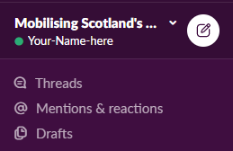
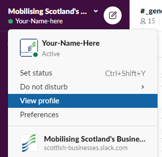
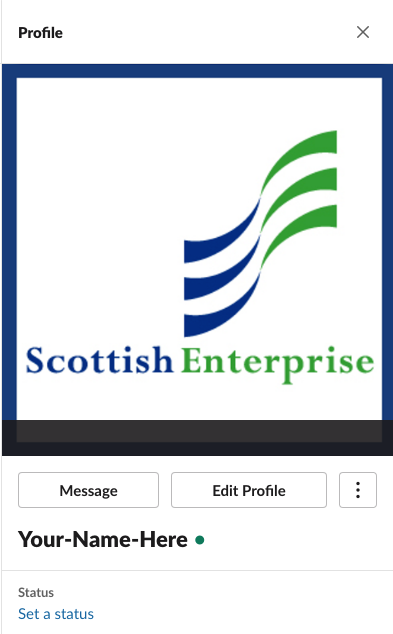
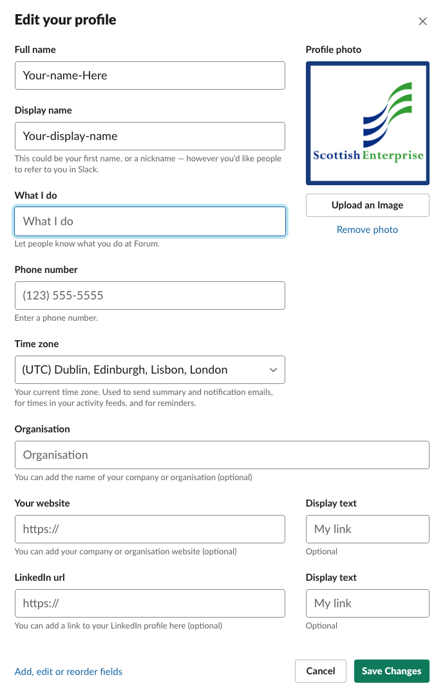

You should have received an invite via email.

1. sign up for your Slack account
2.  create your profile

**Go to the top left where your name appear**

**Select View profile**

**This will open a window in the right part of your screen**

**Select Edit Profile and add information about yourself**

**Enter information about you**
- we won’t display your email address
- most of the fields are not mandatory
- if you do not provide a picture, Slack will provide a random avatar but it would be great if you could add one
- some information like **What I do**, or **your organisation/company’s name** are optional, but if you tell us more about what you do there is more chance of making good quality connections and making sure people engage with you as they will know where you are speaking from
- you can also add your company website and your LinkedIn profile
- all Scottish Enterprise members have added **-SE** at the end of their display name so they are easily identifiable, you could do the same and **add your company name at the end of your display name**

## You are ready!
Start engaging with other businesses

