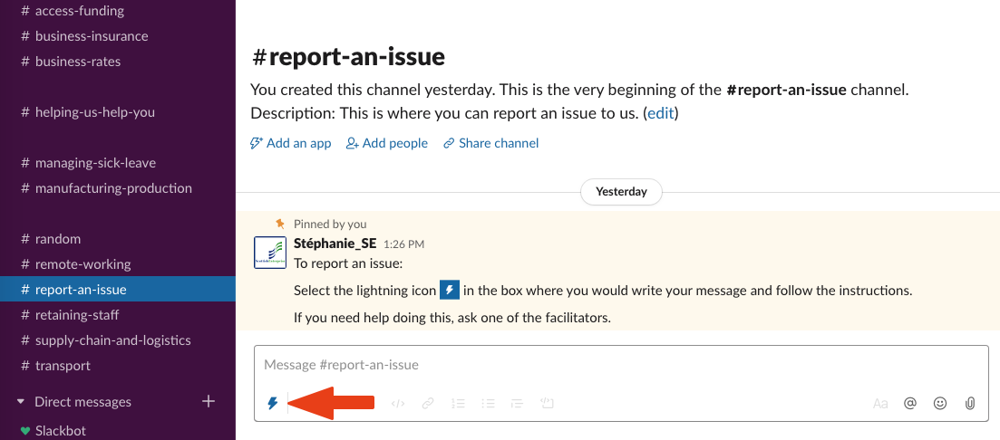
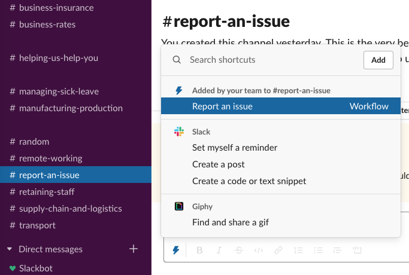
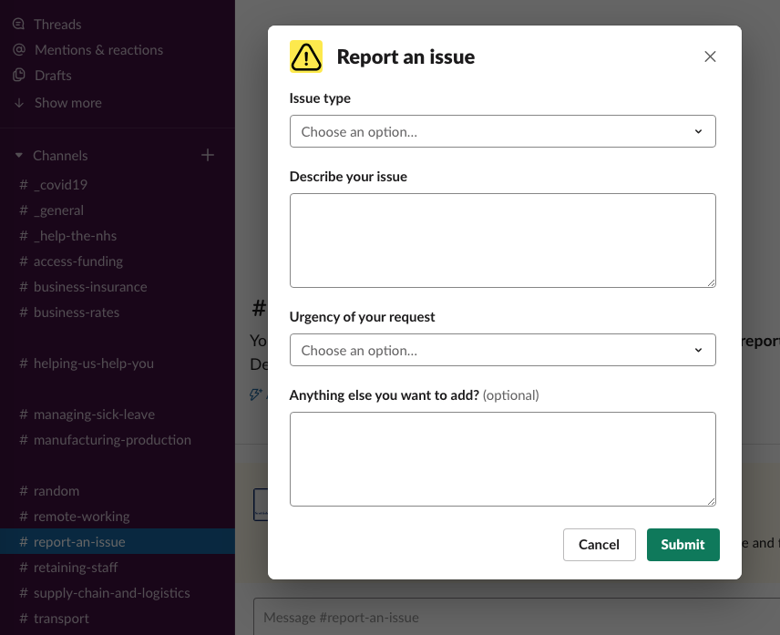

We are committed to providing an accessible and useful service for the Scottish Business community.

However, if you believe that things have gone wrong, or that another user has broken these rules of engagement, please send your complaints or comments to the Facilitator team through the **#report-an-issue** channel.

## To report an issue

1) Go the **#report-an-issue** channel

2) Look for the lightning icon in the box where you would write your message:

3) Select the icon and you will see a menu with: **Report an issue**

4) Once you select **Report an issue**, a form will appear on screen

5) Follow the instructions

## We will try to respond to any complaint within five working days.
